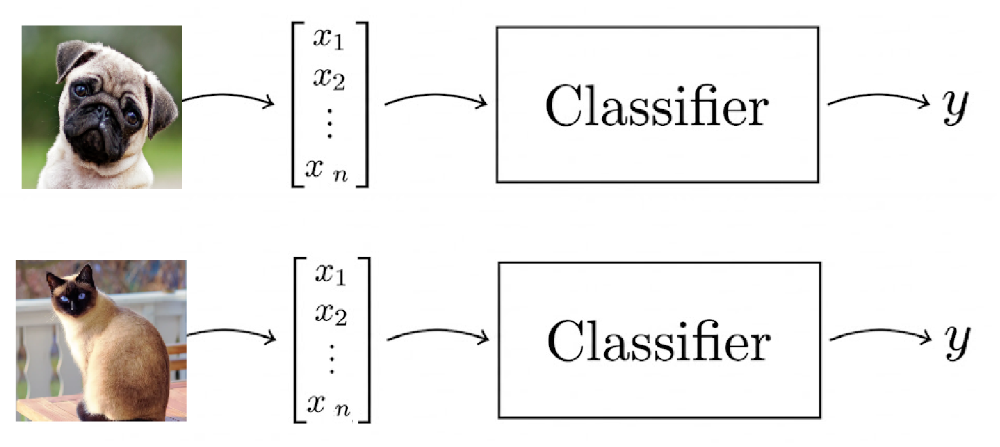

# Aprendizaje Supervisado

Dado un conjunto de puntos de datos $${x^{(1)}, \ldots, x^{(m)}}$$ asociados a un conjunto de resultados $$y^{(1)}, \ldots, y^{(m)}$$. Queremos construir un modelo que aprenda a predecir $$y$$ a partir de $$x$$.

El objetivo del aprendizaje supervisado es dado uno conjunto de datos $${x^{(1)}, \ldots, x^{(m)}}$$ y otro conjunto de resultados $${y^{(1)}, \ldots, y^{(m)}}$$ donde se encuentra un conjunto de tuplas $${(x^{(1)},y^{(1)}), \ldots, (x^{(m)},y^{(m)}})$$. Queremos construir un modelo que "aprende" del conjuto de tuplas el cuál dados $${{\hat{x}^{(1)}, \ldots, \hat{x}^{(n)}}}$$ prediga el $${{\hat{y}^{(1)}, \ldots, \hat{y}^{(m)}}}$$.

**Ejemplo**

Un clasificador binario donde prediga dada una imagen sea un gato o un perro.

<figure><figcaption></figcaption></figure>
